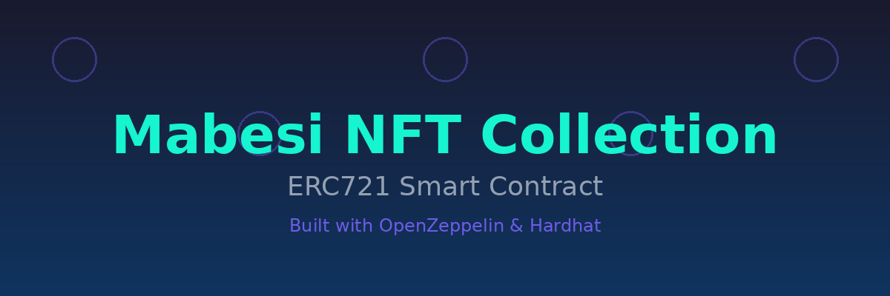

# Mabesi NFT Collection

**[🇺🇸 Read in English](README.md)**



Uma implementação completa de smart contract NFT ERC721 construída com contratos OpenZeppelin e ambiente de desenvolvimento Hardhat.

## :speech_balloon: Descrição

Mabesi NFT Collection é um smart contract NFT pronto para produção que implementa o padrão ERC721 com recursos avançados incluindo enumeração, armazenamento de URI e tokens queimáveis. Construído sobre os contratos OpenZeppelin testados em batalha, este projeto fornece uma base sólida para criar e gerenciar coleções de NFT na Ethereum e blockchains compatíveis com EVM.

O contrato possui gerenciamento automático de IDs de tokens, URIs de metadados personalizáveis e cobertura abrangente de testes para garantir confiabilidade e segurança.

## Índice

- [Funcionalidades](#funcionalidades)
- [Construído Com](#construído-com)
- [Começando](#começando)
  - [Pré-requisitos](#pré-requisitos)
  - [Instalação](#instalação)
  - [Configuração](#configuração)
  - [Uso](#uso)
  - [Testes](#testes)
  - [Deploy](#deploy)
- [Detalhes do Contrato](#detalhes-do-contrato)
- [Informações Finais](#informações-finais)
  - [Agradecimentos](#agradecimentos)
  - [Contribuindo](#contribuindo)
  - [Autores e Contribuidores](#autores-e-contribuidores)
  - [Aviso Legal](#aviso-legal)
  - [Licença](#licença)

## Funcionalidades

- **Conformidade com Padrão ERC721**: Implementação completa do padrão NFT ERC721
- **Extensão Enumerável**: Rastreie e enumere todos os tokens e tokens pertencentes a cada endereço
- **Armazenamento de URI**: Gerenciamento flexível de metadados com URIs de token personalizáveis
- **Tokens Queimáveis**: Os detentores de tokens podem queimar (destruir) seus tokens
- **IDs de Token Auto-incrementais**: Gerenciamento automático de IDs de token usando Counters da OpenZeppelin
- **URI Base Personalizada**: Hospedagem centralizada de metadados com URI base personalizável
- **Suíte de Testes Abrangente**: 100% de cobertura de testes com mais de 15 casos de teste
- **Desenvolvimento Type-Safe**: Suporte completo a TypeScript com Hardhat e ethers.js

## Construído Com

- [Solidity ^0.8.17](https://soliditylang.org/) - Linguagem de programação de smart contracts
- [Hardhat ^2.17.0](https://hardhat.org/) - Ambiente de desenvolvimento Ethereum
- [OpenZeppelin Contracts ^4.9.2](https://openzeppelin.com/contracts/) - Biblioteca de smart contracts seguros
- [TypeScript](https://www.typescriptlang.org/) - Desenvolvimento type-safe
- [Ethers.js](https://docs.ethers.org/) - Biblioteca Ethereum para interação com contratos
- [Chai](https://www.chaijs.com/) - Framework de testes

## Começando

### Pré-requisitos

- Node.js >= 16.0.0
- Gerenciador de pacotes npm ou yarn
- Git

### Instalação

1. Clone o repositório:
```bash
git clone https://github.com/mabesi/mabesi-nft-collection.git
cd mabesi-nft-collection
```

2. Instale as dependências:
```bash
npm install
```

### Configuração

O projeto usa a configuração padrão do Hardhat. O contrato está configurado para compilar com a versão 0.8.19 do Solidity.

Para personalizar o deploy ou adicionar configurações de rede, edite `hardhat.config.ts`:

```typescript
import { HardhatUserConfig } from "hardhat/config";
import "@nomicfoundation/hardhat-toolbox";

const config: HardhatUserConfig = {
  solidity: "0.8.19",
  // Adicione suas configurações de rede aqui
};

export default config;
```

### Uso

#### Compilar os contratos:
```bash
npx hardhat compile
```

#### Executar a suíte de testes:
```bash
npx hardhat test
```

#### Verificar cobertura de testes:
```bash
npx hardhat coverage
```

### Testes

O projeto inclui uma suíte de testes abrangente cobrindo todas as funcionalidades do contrato:

- Cunhagem de tokens
- Queima de tokens (proprietário, aprovado e aprovado para todos)
- Transferências de tokens
- Mecanismos de aprovação
- Gerenciamento de URI de metadados
- Emissões de eventos
- Validações de permissão

Execute os testes com:
```bash
npx hardhat test
```

### Deploy

Faça o deploy do contrato em uma rede:

```bash
npx hardhat run scripts/deploy.ts --network <nome-da-rede>
```

Para testes locais:
```bash
npx hardhat node
npx hardhat run scripts/deploy.ts --network localhost
```

## Detalhes do Contrato

### Contrato MabesiNFT

**Nome**: MabesiNFT  
**Símbolo**: MBFT  
**URI Base**: `https://mabesinftcollection.com/nft/`

#### Funções Principais

- `mint()`: Cunha um novo NFT para o endereço do chamador
- `burn(uint256 tokenId)`: Queima (destrói) um token
- `tokenURI(uint256 tokenId)`: Obtém a URI de metadados para um token
- `balanceOf(address owner)`: Obtém o número de tokens pertencentes a um endereço
- `ownerOf(uint256 tokenId)`: Obtém o proprietário de um token específico
- `transferFrom(address from, address to, uint256 tokenId)`: Transfere um token
- `approve(address to, uint256 tokenId)`: Aprova um endereço para transferir um token
- `setApprovalForAll(address operator, bool approved)`: Aprova um operador para todos os tokens

#### Contratos Herdados

- `ERC721`: Implementação base de NFT
- `ERC721Enumerable`: Funcionalidade de enumeração de tokens
- `ERC721URIStorage`: Gerenciamento flexível de URI
- `ERC721Burnable`: Capacidade de queima de tokens

## Informações Finais

### Agradecimentos

- [OpenZeppelin](https://openzeppelin.com/) por fornecer bibliotecas de smart contracts seguras e auditadas
- Equipe [Hardhat](https://hardhat.org/) pelo excelente ambiente de desenvolvimento
- A comunidade Ethereum pela inovação contínua

### Contribuindo

Contribuições são bem-vindas! Por favor, siga estes passos:

1. Faça um fork!
2. Crie sua branch de feature: `git checkout -b minha-nova-feature`
3. Adicione suas mudanças: `git add .`
4. Commit suas mudanças: `git commit -am 'Adiciona nova feature'`
5. Push para a branch: `git push origin minha-nova-feature`
6. Submeta um pull request :sunglasses:

### Autores e Contribuidores

| [<br><sub>Plinio Mabesi</sub>](https://github.com/mabesi) |
| :---: |

### Aviso Legal

<p align="justify">O uso desta ferramenta, para qualquer propósito, ocorrerá por sua conta e risco, sendo de sua exclusiva responsabilidade quaisquer implicações legais decorrentes.</p>
<p align="justify">É também de responsabilidade do usuário final conhecer e obedecer todas as leis locais, estaduais e federais aplicáveis. Os desenvolvedores não assumem qualquer responsabilidade e não são responsáveis por qualquer uso indevido ou dano causado por este programa.</p>

### Licença

Este projeto está licenciado sob a [Licença MIT](LICENSE).
